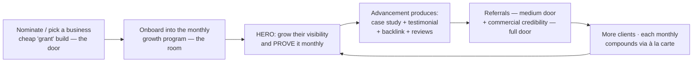

# The Offer Flywheel, Category Chart & À La Carte Model

The actionable model: how we land clients, what we lead with, how the monthly is
built from categories, and how it all compounds. Ties together
PRICING-INFRASTRUCTURE.md (the doors), SALES-ONBOARDING-SYSTEM.md (the journey),
OFFERINGS.md (the menu). Numbers marked [SET] are Jarred's to fix.

---

## THE IDEOLOGY (the wedge)

1. **Maintenance is table stakes, not the pitch.** Hosting/security/backups/
   uptime cost us almost nothing and everyone offers them. They're **included
   and invisible** — never the headline, never a line item to haggle over.
2. **We land with ONE undeniable, provable thing:** *getting them found on
   Google* (local visibility). It's a great pitch because it's the outcome every
   owner wants, and — unlike everyone else selling it — **we prove it every
   month with real data** (map-pack position, reviews, visibility, via
   maps-track + gsc). Proof is the differentiator.
3. **The wedge opens the door to everything else.** Once they see visibility
   climbing, expanding into content, ads, design, brand, social is a natural
   "yes, and…" — added à la carte as trust compounds.
4. **The positioning paradox:** we *deliver* almost everything, but we're
   *marketed* as focused — "the studio that gets local businesses found on
   Google." **Focus in the message, breadth in the delivery.** That's how you
   offer everything without reading as an unfocused generalist.

---

## THE FLYWHEEL

The grant builds aren't charity — they're the marketing engine. Each one throws
off a case study, a "Site by Studio O'Brien" backlink, a review source, and
referrals that feed the medium and commercial doors. The loop tightens as proof
accumulates.

---

## PIPELINES & DOORS (recap, refined)

- **Pipeline A — Commercial:** scalable builds $1,500–2,000 → $10k–30k [SET].
- **Pipeline B — The "grant":** deeply discounted builds (~$500 [SET]).
  - **5 marquee nominees chosen by Jarred** — hand-picked for story/visibility.
  - **Then open community nomination** — a named program; locals nominate
    businesses that need help. (Named program = marketing + makes the low price
    a *gift*, not a discount that anchors your real pricing.)
- **Three doors set the build price by how they arrived:**
  | Door | Build price | Monthly band |
  |---|---|---|
  | Nominated (Pipeline B) | grant rate ~$500 [SET] | grant monthly band [SET] |
  | Referred by a nominee | **medium** [SET] | mid band [SET] |
  | Direct / commercial | full $1.5k–30k [SET] | full band [SET] |

---

## THE CATEGORY CHART (what we do, prioritized by focus)

Every category is something we can **evaluate, offer, and show actionable
ongoing effort toward** — with monthly proof. Not everyone needs all of it; we
evaluate which apply per business.

| Priority | Category | What it is | Role |
|---|---|---|---|
| ★ HERO | **Local Visibility & Growth** | GBP growth, map-pack climb, reviews, local SEO + the monthly proof report | the wedge — nearly everyone starts here |
| ○ BASELINE | **Care** (hosting, security, backups, uptime, small edits) | keep-the-lights-on | included & invisible, ~free |
| ● CORE à la carte | **Content & Posts** | blog/articles, GBP posts | common add-on |
| ● CORE | **Reviews+ / Reputation** | active review campaigns, responses | common add-on |
| ● CORE | **On-page / Technical SEO** | ongoing optimization, new landing pages | common add-on |
| ● CORE | **Conversion / Lead capture** | forms, booking, chat, CRO tweaks | common add-on |
| ◆ EXTENDED | **Brand & Graphics** | logo, social/print assets | as needed |
| ◆ EXTENDED | **Social Media** | posting, profile management | as needed |
| ◆ EXTENDED | **Paid Ads / LSAs** | Google Ads, Local Services Ads, social | as needed |
| ◆ EXTENDED | **Email / Automation** | newsletters, follow-up sequences | as needed |
| ◆ EXTENDED | **New pages / Redesigns / E-commerce** | ongoing build work | as needed |

---

## THE À LA CARTE MONTHLY MODEL

- **Monthly = the hero base + the categories they add.** Maintenance is baked in
  free; the hero (visibility) is the anchor most start with.
- **We evaluate, they choose.** We audit which categories would actually move
  their business, show the actionable plan for each, and they add what they want
  — each added category raises the monthly.
- **Volume incentive (your "reduce rates by how many à la carte things"):** the
  more categories they run with us, the **lower the per-category rate** — bundling
  rewards depth and raises retention. (e.g., 1 category = full rate; 3 = ~15% off
  each; 5+ = ~25% off each. [SET the curve])
- **Different bands by pipeline:** grant clients pay a lower monthly per category
  than commercial clients (their "different pay rate per monthly"). [SET]
- **Every category must SHOW advancement** — a monthly proof point, not a generic
  deliverable. That's what makes it un-pitchable-elsewhere.

---

## FOCUS VS. OFFER (the one-line answer to "what do you do?")
- **Marketed focus:** "We get local businesses found on Google — and prove it."
- **Delivered breadth:** the full category menu above, added as they grow.

---

## OPEN DECISIONS (to lock the model)
1. **Confirm the hero** = Local Visibility & Growth (or name a different wedge).
2. **The category list** — confirm/add/cut categories above.
3. **The volume-discount curve** — how much cheaper per category as they stack.
4. **Monthly bands** — grant vs. medium vs. commercial per-category rates.
5. **The 5 marquee nominees** — who (your pick), and the community-nomination
   program name.

## NEXT COLLATERAL (once the model's locked)
- The **ad script** (the pitch, in your voice, per door).
- The client-facing **price chart** (visual, the categories + bands).
- Per-category **one-pagers** (what each ongoing service delivers + proof).

*Created 2026-07-20, brainstormed with Jarred: an actionable flywheel + category
chart, hero-wedge ideology, à la carte monthly with volume discounts, priced by
door across two pipelines. Maintenance ~free; visibility is the wedge; breadth
delivered, focus marketed.*
